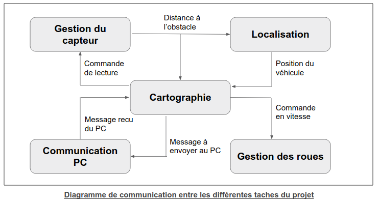

**Phan Nicolas**

**Aggoun Bryan**

**2017 / 2018**

Rapport de Spécification : Projet de véhicule autonome
================================================================================

Contexte
--------------------------------------------------------------------------------

### Situation du projet

Le but de ce projet est de concevoir un véhicule autonome miniature qui effectue
la cartographie du terrain dans lequel il se trouve.

Ce projet est destiné aux étudiants de Licence d'Informatique, le but est de
concevoir entièrement le prototype puis de retirer des parties du programme de
cartographie pour que les étudiants les reconstruisent.
Cet exercice a pour but de les sensibiliser aux enjeux de la programmation
embarquée, notamment l'élaboration d'un algorithme optimisé pour répondre à
des contraintes de temps-réel en puissance de calcul et espace mémoire limitées.

Ce projet sera réalisé en binôme et consistera à adapter et implémenter des solutions logicielles existantes en termes d'algorithmes de cartographie et de gestion de threads.

### Domaine de compétences requises

 * Programmation de microcontrolleur en C

Une grande partie du projet consistera en l’implémentation d’un algorithme de cartographie dans un système commandé par microcontrolleur, il sera donc nécéssaire de maitriser le langage C.

 * Programmation multitache

L’application logicielle contrôlant le véhicule serra constituée de plusieurs processus s’exécutant en parallèle, il est donc nécessaire d’être sensibilisé aux notions de programmation multitache.

 * Conception de circuits analogique élémentaires

Au delà de la partie logicielle, le projet inclut la réalisation d’un système muni de capteurs et d’actionneurs liés à un microcontrolleur central, il y a donc besoin d’interfacer le microcontrolleurs avec ces éléments via des circuits analogiques, d’où le besoin de compétences élementaires en électronique.

Objectif
--------------------------------------------------------------------------------

### Quelles sont les données initiales ?

Nous commençons ce projet en disposant des outils suivants :
Un châssis déjà construit
Deux roues motrices et deux MCC pour les actionner
Une roue avant, folle ou directrice, et un servomoteur pour l’orienter si elle est directrice
Un capteur à ultrasons et un servomoteur pour l’orienter
Une carte Arduino basé sur le microcontrolleur ….

Au départ, le véhicule ne possède aucune information sur le terrain.

### Quels sont les résultats attendus ?

De manière générale, l’objectif final est d’obtenir un prototype ayant le comportement suivant :
Le véhicule explore le terrain et à la fin de son parcours, il obtient une représentation en mémoire de la carte du terrain qu’il a exploré, indiquant pour chaque zone élementaire s’il elle contient un obstacle ou si elle est libre.
La taille de la zone élémentaire est à définir plus précisément après une étude des limites du système en terme de précision de mesure, mais l’objectif serait d’atteindre une précision de l’ordre du cm.

Dans notre cas, l’objectif sera le suivant :
 1. Réalisation d’une étude de faisabilité déterminant s’il est possible d’aboutir à une cartographie du terrain précise au centimètre près avec pour seul objet de mesure un capteur à ultrasons.
 2. Dans le cas où le résultat de l’étude est positif, la réalisation d’un prototype fonctionnel.
 3. Dans le cas d'un résultat d'étude négatif, proposer de nouvelles solutions pour contourner les problèmes rencontrés (ajout d'un nouveau capteur, choix d'une microcontrolleur plus adapté etc.).

Problématique
--------------------------------------------------------------------------------

Contrairement aux autres systèmes recevant des informations par GPS, par un accéléromètre ou autres données absolues, ici notre système ne possède qu’un capteur à ultrasons et ne recevra donc qu’une distance relative à la position du véhicule.

Par conséquent, le véhicule aura besoin de se localiser pour construire la carte à partir des informations du capteur, sauf que le véhicule se localise par rapport à la carte donc il a besoin de connaître la carte pour se localiser. Ce problème “d’oeuf et de poule” est le problème de cartographie et localisation simulanées (SLAM Simultaneous Localization and Mapping) et ce sera la problématique principale de ce projet.

De plus, un second objectif sera de mettre en place un mécanisme logiciel permettant l'exécution de plusieurs taches en parallèle car le véhicule devra en effet exécuter plusieurs actions en même temps.

Identification et validation des taches du projet
--------------------------------------------------------------------------------

### Tache : Mise en place d'un mécanisme de gestion de threads

#### Objectif :

Obtenir une plateforme logicielle permettant l'exécution concurrente de plusieurs fils d'exécutions sur le microcontrolleur.

L'application logicielle devra effectuer plusieurs fonctions en même temps :
 * Déplacer le véhicule
 * Déplacer le capteur
 * Lire le capteur
 * Construire la carte
 * Se localiser
 * choisir et actualiser un itinéraire
 * Envoyer la carte au PC, au fur et à mesure de sa construction

La solution logicielle appropriée pour la gestion de plusieurs taches en parallèle est la technique de multithreading. Chaque tache sera l'objet d'un fil d'exécution (thread) selon l'agencement suivant : 

| Fonction à effectuer	| Tache associée	|
| --------------------	| --------------	|
| Déplacer le véhicule	| Commande des roues	|
| Déplacer le capteur	| Gestion du capteur	|
| Lire le capteur	| Gestion du capteur	|
| Construire la carte	| Cartographie		|
| Se localiser		| Localisation		|
| Choisir un itinéraire	| Cartographie		|
| Envoyer la carte au PC| Communication PC	|

L'ensemble des taches présentes plus bas est exactement l'ensemble des "Taches associées" du tableau ci-dessus. La tache Cartographie est la tache maitresse, elle décidera de la politique d'ordonnancement entres les taches (elle sera le "chef d'orchestre") tandis que les autres taches seront des taches esclaves.

#### Travail à réaliser :
- [ ] Se renseigner sur les différentes solutions existantes en terme de mécanismes de gestion de threads.
- [ ] Comparer ces solutions et choisir la plus appropriée dans notre cas
- [ ] Implémenter le mécanisme choisi 

#### Validation :

Le but ici est de créer des threads effectuant quelques affichages pour vérifier que l'environnement mis en place est fonctionnel.

- [ ] Ecriture d'un thread affichant "Hello world" en boucle. Vérifier que le thread s'exécute correctement
- [ ] Ecriture de plusieurs threads ayant des affichages différents. Vérifier qu'ils s'exécutent correctement.
- [ ] Ecriture d'un thread producteur, lisant l'entrée standard et un thread consommateur, écrivant sur la sortie standard. Tout ce qui est tapé au clavier sera lu par le thread producteur, qui renverra la donnée vers le consommateur qui l'affichera à l'écran. Cela permet de tester la communication entre threads. Vérifier que l'affichage correspond bien à ce qui a été entré au clavier.
- [ ] Ecriture d'un thread maitre est un thread esclave, affichant chacun leur nom est un timestamp lorsqu'ils commutent. Le thread maitre passe la main à l'esclave toutes les secondes pendant 0.1 seconde. Vérifier que l'ordonnancement imposé par le maître est bien en place.

### Tache : Commande des roues

#### Objectif : 

Pouvoir controler le déplacement du véhicule de manière logicielle.
Plus précisément, il s’agit d’obtenir une ou plusieurs fonctions logicielles pouvant être appelée par un programme utilisateur et permettant de controller la vitesse des roues pour faire avancer et tourner le véhicule.

#### Travail à réaliser :

- [ ] Concevoir l’interface électronique entre les MCC et la carte Arduino
  - [ ] Se documenter sur les différentes méthodes couramment utilisées pour interfacer une unité de commande faible-puissance (ici un microcontrolleur) et un moteur à courant continu.
  - [ ] Comparer ces différentes méthodes et sélectionner la plus appropriée
- [ ] Concevoir le driver de controle des MCC
  - [ ] Déterminer l’interface utilisateur (comment la fonction de commande des roues doit être appelée et avec quels arguments, par exemple est-ce que l’utilisateur fournit un vecteur vitesse que la fonction devra constamment suivre ou bien est-ce que l’utilisateur appelle la fonction pour aller à une vitesse v pendant n secondes)
  - [ ] Déterminer les signaux de commande (en sortie du microcontrolleur) à envoyer pour commander les roues à une vitesse v.
  - [ ] Implémenter la fonction de commande des roues, envoyant les signaux appropriés à l’interface électronique des MCC en fonction des paramètres utilisateurs fournis.

#### Validation :

- [ ] Commander les roues en translation avec une vitesse donnée et comparer la vitesse réelle du véhicule (mesurée à la règle et au chronomètre) avec la vitesse donnée en commande.
  - [ ] Test avec v = 0, le véhicule doit rester à l’arrêt
  - [ ] Test avec v = 0.5 m/s, chronométrer la durée nécéssaire au véhicule pour parcourir 1m, 2m, 5m, 10m.
  - [ ] Effectuer le même test que 1.2 avec v = 1m/s
  - [ ] Envoyer une suite de commande : 0.5 m/s pendant 1s puis 1m/s pendant 1s puis 0m/s, puis filmer le véhicule et mesurer sur la vidéo si sa vitesse au cours du temps correspond bien à la suite de commande effectuée.
- [ ] Commander les roues en rotations, avec une vitesse de rotation donnée et comparer la vitesse réelle avec la vitesse désirée.
  - [ ] Test avec v = 0 rad/s, le véhicule ne doit pas tourner.
  - [ ] Test avec v = pi/2 rad/s, le véhicule doit tourner à une allure constante.
  - [ ] Test avec plusieurs valeurs successives, v = pi/4, v = pi/2, v = -pi/2, v = - pi/4 rad/s

### Tache : Gestion du capteur à ultrasons

#### Objectif :

Obtenir un ensemble de fonctions permettant d'orienter le capteur et de
récupérer l'information captée.

#### Sous-tache : Récupération des informations du capteur

#### Travail à réaliser :

- [ ] Concevoir l'interface électronique entre le capteur et le microcontrolleur
  - [ ] Se renseigner, notamment dans la documentation du capteur fourni, sur
l'interfacage électronique à mettre en place pour alimenter le capteur et récupérer les données captées.
  - [ ] Réaliser cette interface
- [ ] Ecrire la couche logicielle permettant d'accéder aux données captées
  - [ ] Déterminer la donnée lue du capteur en fonction de la distance à laquelle l'obstacle se situe (pour cela, placerons un obstacle à différentes distances du capteur et noterons les différentes valeurs lues)
  - [ ] Déterminer la portée du capteur, la distance minimale et maximale au delà desquelles le capteur ne renvoie plus de donnée pertinente.
  - [ ] Ecrire une fonction donnant la distance mesurée par le capteur.

#### Validation :

- [ ] Placer un objet à une distance d du capteur, vérifier que la fonction renvoie bien une distance correspondant à d.
  - [ ] Effectuer une mesure avec un objet à distance minimale de portée du capteur
    - [ ] Et ce avec un objet de plus de 30cm de largeur
    - [ ] Avec un objet de 10cm de largeur
    - [ ] Avec un objet de 5cm de largeur
    - [ ] Avec un objet de 2cm de largeur
  - [ ] Effectuer une mesure avec un objet à distance maximale de portée du capteur
    - [ ] Et ce avec un objet de plus de 30cm de largeur
    - [ ] Avec un objet de 10cm de largeur
    - [ ] Avec un objet de 5cm de largeur
    - [ ] Avec un objet de 2cm de largeur
  - [ ] Effectuer une mesure avec un objet à distance intermédiaire dans la portée du capteur. 
    - [ ] Et ce avec un objet de plus de 30cm de largeur
    - [ ] Avec un objet de 10cm de largeur
    - [ ] Avec un objet de 5cm de largeur
    - [ ] Avec un objet de 2cm de largeur
  

#### Sous-tache : Controle de l'orientation du capteur 

#### Travail à réaliser :
- [ ] Concevoir l'interface électronique permettant de contrôler l'orientation du capteur via un servomoteur
  - [ ] Déterminer les différentes solutions permettant cet interfacage
  - [ ] Implémenter la solution la plus appropriée
- [ ] Ecrire la couche logicielle permettant d'orienter le capteur
  - [ ] Déterminer le signal à envoyer en sortie du microcontrolleur en fonction de l'angle dans lequel on veut orienter le capteur.
  - [ ] Ecrire une fonction prenant en entrée un angle et orientant le capteur à l'angle donné.

#### Validation :

- [ ] Appeler la fonction d'orientation du capteur avec plusieurs angles et vérifier si le capteur s'oriente conformément à l'angle donné.
  - [ ] Effectuer cet appel avec un angle de 0 rad/sec
  - [ ] Effectuer cet appel avec un angle de +pi/2 rad/sec
  - [ ] Effectuer cet appel avec un angle de -pi/2 rad/sec
  - [ ] Effectuer cet appel avec des angles intermédiates (ex: pi/4, pi/6). 

### Tâche : Localisation
 
#### Objectif :

Obtenir, en comparant l’instant t et l’instant t-1, le déplacement de la voiture à chaque instant (en translation et en rotation), puis en déduire la position par rapport à son point de départ.
 
En sortie de cette tâche à réaliser se présentera un thread mettant constamment à jour les variables contenant le déplacement élémentaire du véhicule et sa position sur la carte.
 
#### Travail à réaliser :

- [ ] Etudier les différentes méthodes de localisation d’un système et choisir la méthode la plus adaptée pour ce projet.
  - [ ] Lister les données sur l’état du système que nous aurons à disposition.
  - [ ] Trouver un modèle, une méthode de localisation adapté à notre système :
    - Utilisation de ressources connues
    - Méthode peu coûteuse en mémoire
    - Une précision des calculs suffisante
  - [ ] Lister les données indispensables à connaître pour retrouver la position du véhicule (Position à l’instant t-1, déplacement en translation et rotation effectué à l’instant t-1, …).
- [ ] Ecrire un programme permettant de calculer et mettre à jour la position du véhicule.
  - [ ] Choix d’une méthode logiciel pour récupérer les données nécessaires à la localisation du véhicule venant des autres modules du systèmes (un tableau en variable global, une structure, …)
  - [ ] Trouver une méthode mathématique permettant de retrouver le déplacement en x et y effectuer par la voiture entre un instant t-1 et t.
  - [ ] Retrouver la position du véhicule à l’instant t grâce déplacement en x et y calculés précédemment.
  - [ ] Implémenter logiciellement cette méthode de localisation.
    
#### Validation :

- [ ] Faire un programme de test permettant de s’assurer qu’il est possible, avec la méthode trouver, de récupérer à tout instant les données du système nécessaire pour la tâche de localisation du véhicule.
- [ ] Déplacer le véhicule aléatoirement et connaître sa position à tout instant
  - [ ] Déplacer le véhicule de manière linéaire sans rotation et connaître sa position
    - [ ] Faire un déplacement linéaire d’une certaine distance à vitesse continue et calculer la position du système
    - [ ] Comparer la position calculée avec la position attendue
    - [ ] Répéter plusieurs fois l’opération et s’assurer qu’au bout d’un certain nombre de translation la position calculée ne devient pas obsolète en raison des incertitudes provenant de chacun des calculs réalisés.
  - [ ] Déplacer le véhicule dans toutes les directions et connaître sa position
    - [ ] Faire un déplacement quelconque avec rotation, vitesse constante et calculer sa position
    - [ ] Comparer la position calculée avec la position attendue
    - [ ] Répéter plusieurs fois l’opération et s’assurer qu’au bout d’un certain nombre de translation la position calculée ne devient pas obsolète en raison des incertitudes provenant de chacun des calculs réalisés.

### Tache : Communication avec le PC

#### Objectif :

Elaborer un mécanisme permettant à l'application d'envoyer et recevoir des messages depuis/vers un PC via une liaison sans fil.
Plus précisément, il s'agira d'écrire une fonction qui effectue l'envoi d'une chaine de caractère vers le PC, un mécanisme d'interruption permettant de prévenir la tache maitresse de la réception d'un message, puis une deuxième fonction permettant de lire le message recu.

#### Travail à réaliser :

- [ ] Choix d'un module de communication sans-fil pour la liaison avec le PC.
- [ ] Obtention ou réalisation d'un proramme côté PC permettant d'envoyer/recevoir des chaines de caractère via la liaison sans-fil
- [ ] Ecriture d'une fonction (dans le programme du microcontrolleur) permettant d'envoyer des chaines de caractère
- [ ] Ecriture d'une fonction permettant de détecter la réception d'une chaine de caractère, et de la lire dans ce cas là.

#### Validation :

- [ ] Vérification de la communication Arduino vers PC
  - [ ] Envoi d'un caractère, vérifier si le caractère envoyé a bien été reçu côté PC.
  - [ ] Envoi d'une chaine de caractères, vérifier l'intégrité de la chaine.
  - [ ] Plusieurs envois successifs, vérifier que tous les envois aboutissent.
- [ ] Vérification de la communication PC vers Arduino
  - [ ] Envoi d'un caractère, vérifier qu'une interruption est bien levée et que le caractère reçu est correct.
  - [ ] Envoi d'une chaine de caractères, même test
  - [ ] Plusieurs envois successifs, vérifier qu'aucun message n'est perdu.

### Tache : Cartographie

#### Objectif :

Cette tache consiste en l'implémentation d'un algorithme de cartographie et localisation simultanées. Il s'agit de la tâche maitresse : c'est celle qui a le controle sur les autres dans la mesure où elle décide de l'ordonnancement des threads.

#### Travail à réaliser :

- [ ] Choisir un algorithme de cartographie et localisation simultanées
- [ ] Implémenter l'algorithme choisi
  - [ ] Implémenter un mécanisme de correction du déplacement du véhicule

#### Validation :

Une première phase de validation consistera à surveiller la précision avec laquelle le véhicule mesure les distances et les angles car des mesures incorrectes entrainent une carte incorrecte.
Pour cela, nous nous placerons en environnement connu (la carte sera déjà préchargée dans la mémoire du système) et le véhicule effectuera des déplacements pour voir s'il est correctement calibré.

- [ ] Vérifier que le véhicule est géométriquement précis
  - [ ] Vérifier la précision en translation. Il faut que le véhicule ait parcouru la distance donnée (à quelques cm près) et n'ait pas dévié (la trajectoire doit être droite).
    - [ ] Ecrire une première tache maitresse faisant déplacer le véhicule de 10cm
    - [ ] Idem pour 20cm
    - [ ] Idem pour 2m
    - [ ] Idem pour 10m
  - [ ] Vérifier la précision en rotation
    - [ ] Ecrire une tache maitresse effectuant : translation de 1m, rotation de alpha rad, translation de 1m, et Vérifier que la voiture tourne avec l'angle donné.
      - [ ] Effectuer la vérification pour alpha = 0 (le véhicule doit simplement avancer de 2m)
      - [ ] Pour alpha = 10, 20, 30, 40, 50, 60, 70, 80, 90 degrés
      - [ ] Idem dans les négatifs : pour alpha = -10 à -90 degrés 
    - [ ] Ecrire une tache maitresse effectuant parcours où il est censé revenir à son point de départ. Vérifier que la trajectoire parcourue est précise (plus ou moins quelques centimètres) et que le véhicule est bien retourné au point de départ.
      - [ ] Effectuer un parcours carré : translation 1m puis rotation pi/2, et ce quatre fois.
      - [ ] Effectuer un parcours octogonal : translation 50cm = et rotation pi/4, huit fois.
      - [ ] Tester des parcours avec d'autres formes géométriques comportant plusieurs valeurs d'angles et de distances différentes

La deuxième phase de test consiste à vérifier le coeur de l'algorithme de cartographie.
Nous placerons le véhicule en environnement inconnu, le démarrerons et vérifierons l'exactitude de la carte retracée.
A chaque test, il faudra vérifier trois choses :
 - Vérifier que l'algorithme se termine bien, qu'il ne reste pas dans une boucle infinie
 - Vérifier que le véhicule ne heurte pas d'obstacles
 - A la fin, vérifier la précision géométrique de la carte reconstruite

Ces tests seront effectuée dans des environnements de plus en plus complexes.

- [ ] Vérifier que la carte est bien construite
  - [ ] Placer le robot dans l'environnement le plus simple : un carré assez petit pour que les murs soient à portée du capteur
  - [ ] Faire de même avec un obstacle central cette fois-ci
  - [ ] Idem avec un terrain carré plus grand que la portée du capteur et des obstacles tous les mètres
  - [ ] Idem avec un terrain octogonal. Cela sert à vérifier le bon fonctionnement du véhicule dans un environnement comportant des angles à 45 degrés.

Communication entre les taches
--------------------------------------------------------------------------------

Le diagramme suivant schématise les données échangées entre les différentes taches.

